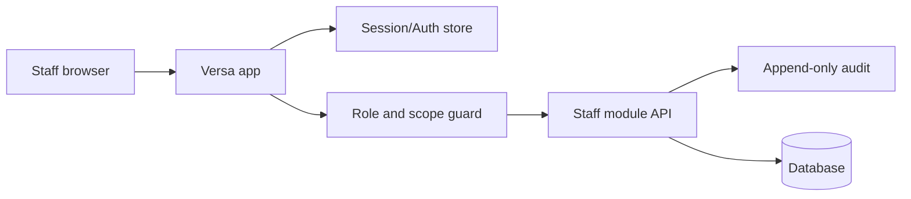
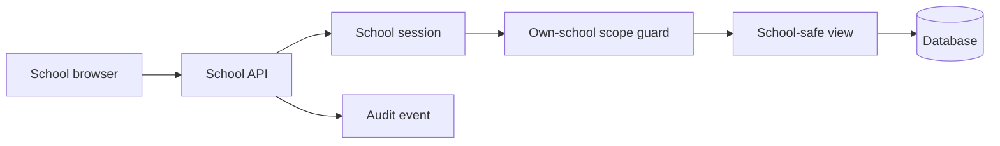
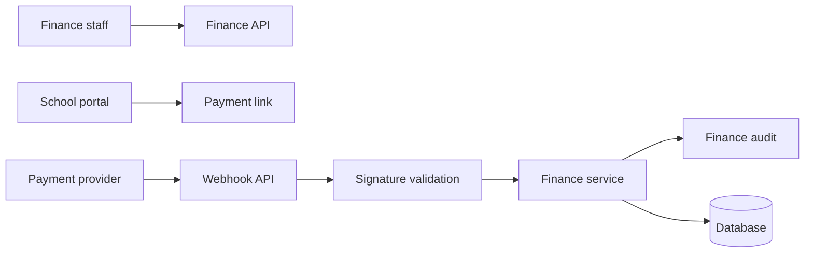
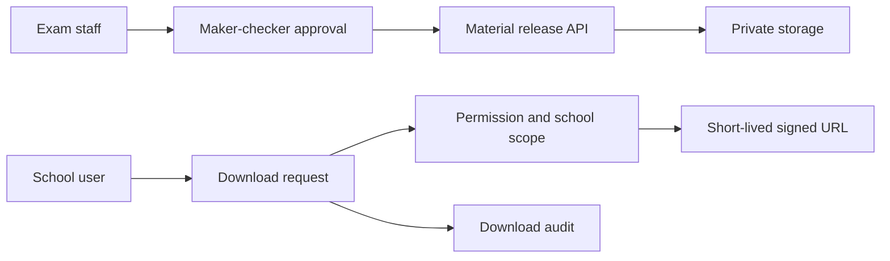
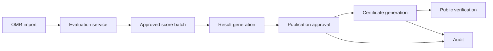
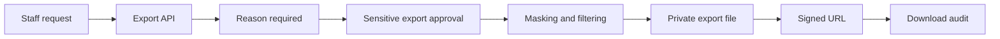

# DATA_FLOW_DIAGRAMS.md

## 1. Staff Auth Flow

## 2. School Scope Flow

## 3. Payment Flow

## 4. Exam Material Release Flow

## 5. Evaluation to Result to Certificate Flow

## 6. Sensitive Export Flow

